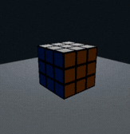

# RayTracerCube - Texturas

Implementación de mapeo de texturas sobre un cubo 3D utilizando **Ray Tracing en Rust**, iluminación difusa y una cámara orbital interactiva.

Este ejercicio extiende el raytracer del cubo para aplicar una textura inspirada en un **cubo Rubik 3x3** mediante coordenadas UV.



---

## Características

- Ray tracing con un rayo primario por píxel
- Intersección rayo-cubo
- Cálculo del punto de impacto
- Normales para las seis caras
- Coordenadas UV
- Mapeo de texturas
- Patrón 3x3 inspirado en un cubo Rubik
- Diferentes colores según la cara
- Iluminación difusa
- Fuente de luz fija
- Cámara orbital interactiva
- Base para el escenario

---

## Mapeo de texturas

Cuando un rayo intersecta el cubo, el punto de impacto se utiliza para determinar qué cara fue alcanzada y calcular sus coordenadas **UV**.

```text
Rayo primario
  ↓
Intersección con el cubo
  ↓
Punto de impacto
  ↓
Identificación de la cara
  ↓
Coordenadas UV
  ↓
Textura del Rubik
  ↓
Iluminación difusa
  ↓
Color final
```

Las coordenadas UV permiten transformar una posición sobre la superficie 3D del cubo en una posición 2D utilizada para determinar el color de la textura.

---

## Cámara orbital

La cámara permanece apuntando hacia el centro de la escena mientras orbita alrededor del cubo.

| Tecla | Acción |
|:---:|---|
| `←` | Orbitar hacia la izquierda |
| `→` | Orbitar hacia la derecha |
| `↑` | Orbitar hacia arriba |
| `↓` | Orbitar hacia abajo |
| `Esc` | Cerrar |

El cubo y la fuente de luz permanecen fijos. Únicamente cambia la posición de la cámara.

---

## Ejecución

Requiere Rust y Cargo.

Si ya tienes el repositorio:

```bash
git switch ejercicio-texturas
cargo run
```

Para regresar al ejercicio sin texturas:

```bash
git switch ejercicio-cube
cargo run
```

---

## Tecnologías

- Rust
- Ray Tracing
- minifb
- Mapeo UV

---

## Branch

El código correspondiente a este ejercicio se encuentra en:

```text
ejercicio-texturas
```