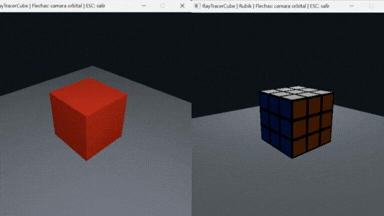

# RayTracerCube

Proyecto desarrollado en **Rust** para practicar los fundamentos de Ray Tracing mediante dos ejercicios: renderizado de un cubo con iluminación difusa y aplicación de texturas mediante coordenadas UV.

Cada ejercicio se encuentra en una branch independiente.

<p align="center">
  
</p>

---

## Ejercicios

### Ray Tracer Cube

Branch:

```text
ejercicio-cube
```

Renderizado de un cubo 3D utilizando:

- Ray tracing
- Intersección rayo-cubo
- Normales por cara
- Iluminación difusa
- Fuente de luz fija
- Cámara orbital interactiva
- Base para la escena

### Ray Tracer Cube con Texturas

Branch:

```text
ejercicio-texturas
```

Extiende el ejercicio anterior agregando:

- Mapeo de texturas
- Coordenadas UV
- Identificación de las seis caras
- Patrón 3x3 inspirado en un cubo Rubik
- Diferentes colores por cara
- Iluminación difusa sobre la textura
- Cámara orbital interactiva

---

## Controles

| Tecla | Acción |
|:---:|---|
| `←` | Orbitar hacia la izquierda |
| `→` | Orbitar hacia la derecha |
| `↑` | Orbitar hacia arriba |
| `↓` | Orbitar hacia abajo |
| `Esc` | Salir |

El cubo y la fuente de luz permanecen fijos. La cámara es la que orbita alrededor de la escena.

---

## Cómo ejecutarlo

Clona el repositorio:

```bash
git clone https://github.com/Anaru03/RayTracerCube.git
cd RayTracerCube
```

### Ejercicio del cubo

Cambia a la branch:

```bash
git switch ejercicio-cube
```

Ejecuta:

```bash
cargo run
```

### Ejercicio de texturas

Cambia a la branch:

```bash
git switch ejercicio-texturas
```

Ejecuta:

```bash
cargo run
```

Para regresar al ejercicio del cubo:

```bash
git switch ejercicio-cube
cargo run
```

---

## Branches

| Branch | Contenido |
|---|---|
| `main` | Documentación general |
| `ejercicio-cube` | Cubo con iluminación difusa |
| `ejercicio-texturas` | Cubo Rubik con mapeo de texturas |

---

## Tecnologías

- Rust
- Ray Tracing
- minifb
- Matemáticas vectoriales 3D
- Mapeo UV